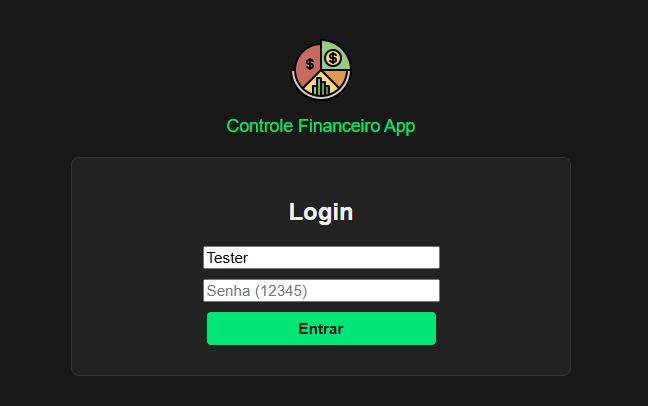
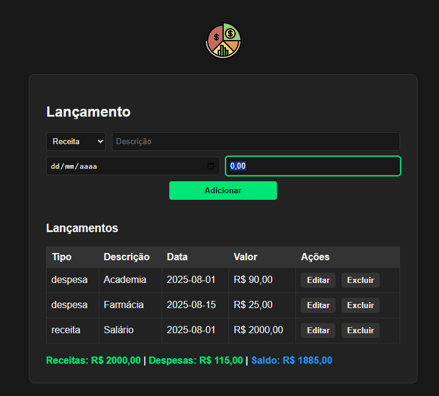

# 💸 Controle Financeiro App


Projeto final da <strong>Mentoria 2.0</strong> do [Julio de Lima](https://github.com/juliodelimas), desenvolvido por [Gustavo dagostin](https://github.com/Gdagostin).


🚀 Este sistema web foi criado para demonstrar boas práticas de automação de testes, qualidade de software e organização de projetos, integrando múltiplos frameworks de teste e pipeline CI/CD.


## 🖼️ Imagens do App


### 🔐 Tela de Login


### 📊 Tela de Lançamentos


## 📋 Sobre o Projeto

O Controle Financeiro App é um sistema simples para gestão de receitas e despesas, com autenticação, controle de lançamentos, totalizador de saldo, interface em tema escuro e validação de campos. \
O foco principal está na automação e qualidade de testes de software, seguindo padrões e referências de mercado.

## 🛠️ Funcionalidades
- Autenticação de usuário
- Cadastro, edição e exclusão de lançamentos
- Totalizador de receitas, despesas e saldo
- Validação de campos obrigatórios
- Interface responsiva em tema escuro
- Testes automatizados funcionais, API e performance

## 🗂️ Estrutura do Projeto
- **api/**: Backend Node.js/Express
- **web/**: Frontend estático
- **tests/functional/cypress/**: Testes funcionais, API e E2E com Cypress
- **tests/performance/**: Testes de performance com K6

## 📦 Dependências
### Backend/API
- express
- cors
- swagger-ui-express

### Frontend/Web
- HTML, CSS, JavaScript

### Testes Funcionais API/E2E
- cypress

### Testes de Performance
- k6

### Outras
- Node.js
- npm

## 📦 Instalação via Git

Clone o repositório:
```sh
git clone https://github.com/Gdagostin/my-software-project.git
```

## ▶️ Como Executar
1. Instale as dependências nas pastas `api`, `web` e `tests/functional`:
   ```sh
   cd api && npm install
   cd /web && npm install
   cd /tests/functional && npm install
   ```
2. Inicie os servidores API e Web:
   ```sh
   cd api && node app.js
   cd web && node server.js
   ```
3. Execute os testes Cypress:
   ```sh
   cd tests/functional && npx cypress run
   ```
4. Execute os testes K6:
   ```sh
   k6 run tests/performance/ct01-login.test.js
   k6 run tests/performance/ct02-lancamentos.test.js
   k6 run tests/performance/ct03-listagem.test.js
   k6 run tests/performance/ct04-totalizador.test.js
   k6 run tests/performance/ct05-estabilidade.test.js
   ```

## 🔑 Credenciais de Acesso

- **Login:** Tester
- **Senha:** 12345

## 🌐 URLs do Sistema

- **API:** http://localhost:3000
- **Web:** http://localhost:4000
- **Swagger:** http://localhost:3000/api-docs

## 🧪 Testes Automatizados
- **Cypress:** Testes funcionais, API e E2E (login, lançamentos, validações, interface)
- **K6:** Testes de performance (login, lançamentos, totalizador, estabilidade)

## ⚙️ Pipeline CI

Este projeto utiliza <strong>GitHub Actions</strong> para rodar testes automatizados (Cypress e K6) e garantir qualidade contínua. Toda alteração enviada para o repositório é validada automaticamente pela pipeline, que instala dependências, sobe servidores, executa os testes e publica relatórios.

## 📊 Relatórios de Testes

Os testes automatizados do projeto utilizam o **Mochawesome Report** para geração de relatórios detalhados das execuções do Cypress. Os relatórios são gerados automaticamente na pasta `cypress/reports` após a execução dos testes, facilitando a análise dos resultados e a rastreabilidade dos cenários testados.

- Para visualizar os relatórios, acesse a pasta `cypress/reports` após rodar os testes Cypress.
- O Mochawesome permite exportar os resultados em HTML, facilitando o compartilhamento e documentação dos testes.

---


## 📚 Documentação

Toda a documentação do projeto está disponível na [Wiki](https://github.com/Gdagostin/my-software-project/wiki), incluindo requisitos, casos de teste, relatórios de bugs e sessões exploratórias.

- [Requisitos](https://github.com/Gdagostin/my-software-project/wiki/Requisitos)
- [Casos de Teste Web](https://github.com/Gdagostin/my-software-project/wiki/Casos-de-Teste-Web)
- [Casos de Teste API](https://github.com/Gdagostin/my-software-project/wiki/Casos-de-Teste-API)
- [Casos de Teste Performance](https://github.com/Gdagostin/my-software-project/wiki/Casos-de-Teste-Performance)
- [Relatório de Bugs](https://github.com/Gdagostin/my-software-project/wiki/Relat%C3%B3rio-de-Bugs)
- [Relatório de Sessão de Testes Exploratórios](https://github.com/Gdagostin/my-software-project/wiki/Relat%C3%B3rio-de-Sess%C3%A3o-de-Testes-Explorat%C3%B3rios)

> O projeto foi testado manualmente e possui documentação detalhada dos testes manuais, garantindo cobertura funcional e validação dos principais fluxos do sistema.
> 

---


## 🤝 Contribuindo

1. 🍴 Fork o projeto
2. 🌿 Crie sua branch (`git checkout -b feature/nova-feature`)
3. 📝 Commit suas mudanças (`git commit -am 'Add: nova feature'`)
4. 📤 Push para branch (`git push origin feature/nova-feature`)
5. 🔃 Abra um Pull Request

## 🛠️ Próximas Implementações
- [ ] Page Object Model
- [ ] Screenshots automáticos
- [ ] Testes em múltiplos browsers
- [ ] Integração com Allure Reports
- [ ] Docker para ambiente isolado


## 🔗 Referências
- [Mentoria 2.0 Julio de Lima](https://mentoria.juliodelima.com.br/)
- ISO/IEC 29119-3 (Testes de Software)


> Projeto para fins de aprendizado, demonstração de automação de testes e boas práticas em qualidade de software.
> Autor: [Gdagostin](https://github.com/Gdagostin)
